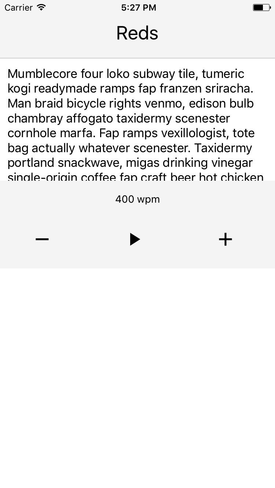
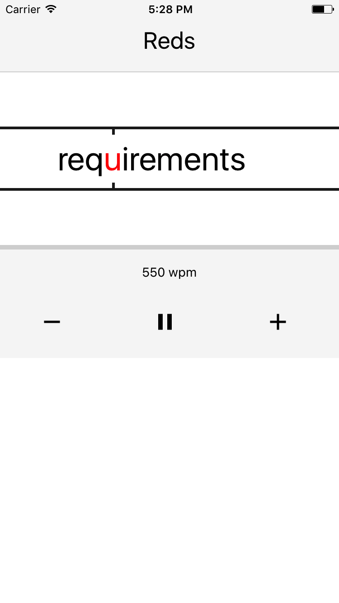

# Reds

## Spritz reader for iOS and Android

Start screen             |  Reading screen
:-------------------------:|:-------------------------:
  |  

## How to run  
Requires react-native-cli, yarn  

1. Install dependencies `yarn install`
2. Run `react-native run-ios` or `react-native run-android`
